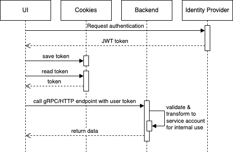
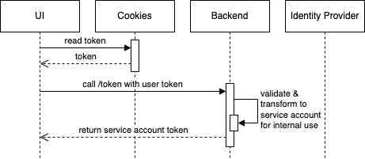
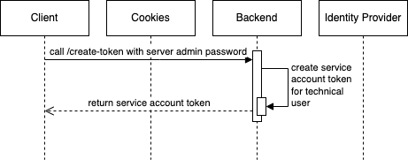

# infra-auth-lib

Auth Library for infra&amp;automation services for OIDC.

## How to create the OIDC configuration file

Create an OIDC application on your identity provider. Remember client ID, client secret, issuer, and which endpoint(s) you configured.

Generate a session secret with:

```bash
python3 -c 'import os,base64; print(base64.urlsafe_b64encode(os.urandom(32)).decode())'
```

Create the file. Your `oidc.yaml` config can look like this, if the IDP provides a well-known openid configuration.

```yaml
issuer: https://idp.company.corp
```

If your IDP does not provide the configuration file, can still configure this manually. Your `oidc.yaml` may look like:

```yaml
offlineProviderConfig: true
issuer: https://idp.company.corp
authUrl: https://idp.company.corp/oauth/authorize
tokenUrl: https://idp.company.corp/oauth/token
userInfoUrl: https://idp.company.corp/oauth/userinfo
jwksUrl: https://idp.company.corp/oauth/discovery/keys
algorithms:
  - RS256
```

In any case, add client and session information, endpoint, additional access token claims, allowed email suffix, and blocked email addresses to this file:

```yaml
clientID: awesome-application-id
clientSecret: Y0xZeFNYVVNkLWJMRWJ0cXNzbmk4QUNna3o1dGUyOTZsUWRCcjFBak51Yz0K
sessionSecret: Tf12qmXZ5y3kWK5M9wmc_dXjN0GUwhtEcErixd07n1U=
endpoint: your-app.company.corp
accessTokenClaims:
  - value: https://idp.company.corp
    op: eq
    path: iss
  - value: authorized-users
    op: in
    path: realm_access.roles
allowedEmailSuffix: "@company.com"
emailBlockList:
  - donotreply@invalid.domain
```

## How it works

## Login flow for humans



This displays the initial login flow.
For subsequent access, if the token stored in the cookie is still valid, the hop to the identity provider is skipped.

The authentication middleware in the backend transforms the user token into a service account, which can be accessed from the context in the request handlers.

## Human access to backend with Service Account Token



Humans can access their service account token through the UI (or calling the `/token` endpoint directly).
They authenticate this request with their user token, provided by the identity provider.

The returned service account token can be used for subsequent API requests.

## Technical user access to backend with Service Account Token



An administrator calls the `/create-token` with the admin password from the server configuration.
In this request, they must specify a name, description and an email address.

The returned service account token can be used for subsequent API requests.
